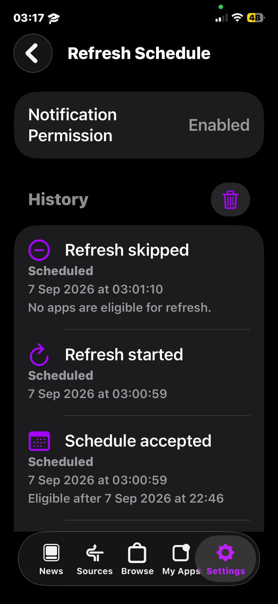

# LiveContainer + SideStore Auto-Refresh

[](https://github.com/NRG-Wardog/sidestore-auto-refresh/actions/workflows/livecontainer-build.yml)
[](https://github.com/NRG-Wardog/sidestore-auto-refresh/releases/latest)
[](LICENSE)

LiveContainer with embedded SideStore, native refresh scheduling, and an on-device
**LocalDevVPN + CoreDevice** refresh path for a **Free Apple Account / Personal Team**.

The intended refresh runtime needs **no PC, USB, external relay, jailbreak, paid
developer membership, custom NetworkExtension, or modified VPN app**. Initial
signing and installation still require a compatible installer.

## Download

### LiveContainer + embedded SideStore: v2.0.0

**[Download the combined IPA](https://github.com/NRG-Wardog/sidestore-auto-refresh/releases/download/v2.0.0/LiveContainer-SideStore-AutoRefresh-v2.0.0.ipa)**

[Latest stable release](https://github.com/NRG-Wardog/sidestore-auto-refresh/releases/latest)
| [Release notes](docs/RELEASE_NOTES_v2.0.0.md)
| [Checksums](https://github.com/NRG-Wardog/sidestore-auto-refresh/releases/download/v2.0.0/SHA256SUMS.txt)

- Builder: `f20e14e43b4048c5b5791e7d4b0bb6e32930c10a`
- [Verified build 34238644076](https://github.com/NRG-Wardog/sidestore-auto-refresh/actions/runs/34238644076)
- 76 CI tests, 2 skipped; both Release builds and combined-package checks passed.
- SHA-256: `1c29648ee99abd67cd6244d0405f2ab9df0beca92adb4c35bed5c133eb7d974e`

Sign with your own account. **Update over the existing same-team,
same-identifier LiveContainer installation; do not delete it first.** Back up
important guest data. Standalone-to-combined data migration is not provided.

### Standalone SideStore: v1.0.2

**[Download standalone SideStore](https://github.com/NRG-Wardog/sidestore-auto-refresh/releases/download/v1.0.2/SideStore-CoreDevice-AutoRefresh-v1.0.2.ipa)**
| [Standalone release notes](docs/RELEASE_NOTES_v1.0.2.md)

This separate variant keeps SideStore and up to two other personally signed
standalone apps within the normal free-account installed-app limit. It is not
bundled into the v2.0.0 release. Update it over the matching existing SideStore
installation, not over LiveContainer.

## What is included

- **Combined upstream packaging:** embedded SideStore and dependencies, widget,
  LiveProcess, ShareExtension, LaunchAppExtension, and required intent/group metadata.
- **LocalDevVPN/CoreDevice transport:** service TLS, CDTunnel, RSD, AFC staging,
  installation routing, transfer reliability, and explicit transport diagnostics.
- **Native-first automation:** six-hour, daily, and weekly schedules, background
  processing, a lightweight watchdog, launch/resume recovery, and bounded retry.
- **Deadline protection:** optional AlarmKit safety alerts on iOS 26.1+ when
  authorized, with local-notification fallback. Shortcuts are optional.
- **Refresh status:** manual/scheduled history, deletion controls, actionable
  failures, run-correlated verification results, and bounded console logs.
- **Embedded startup/authentication fixes:** host identity hooks, safe database
  retries, shared-Keychain migration, and reusable-session-aware preflight.
- **Guest Return controls:** draggable button, collapsible edge tab, global
  visibility setting, and automatic hiding in windowed multitasking.

## Quick start: combined build

1. Sign/install the combined IPA using a compatible installer and your Apple account.
2. Enable Developer Mode and provide a valid Lockdown pairing file.
3. Configure official App Store LocalDevVPN as described below.
4. Open LiveContainer, then embedded SideStore, and sign in.
5. Perform a manual refresh first; inspect its result and signing expiration.
6. In LiveContainer's refresh settings, enable automation and choose a schedule.
7. Allow notifications and Background App Refresh for the protections you want.
8. Keep Wi-Fi and the correctly configured LocalDevVPN route available.

For standalone v1.0.2, use SideStore > Settings > Refreshing Apps > Refresh Schedule.

**In the combined build, selected time is a target deadline, not an exact wake
time.** Background requests are scheduled earlier, subject to eligibility and
retry timing. iOS can delay or omit execution. Daily or six-hour schedules provide
more safety margin than weekly scheduling near a seven-day signing expiration.

Foreground refresh can request LocalDevVPN activation and recheck readiness after
returning. Background refresh does not try to force-open another app: it records
the failure and uses bounded recovery. Cellular-only refresh is not supported.

## Required LocalDevVPN setup

Use **Wi-Fi + official unmodified App Store LocalDevVPN**. VPN Super and an
additional IKEv2/IPSec tunnel are not required by the CoreDevice path.

Choose two unused IPv4 addresses in the **same subnet** as the iPhone's current
Wi-Fi network. Configure both with **/32** in LocalDevVPN's Network Configuration.

Example only, for a Wi-Fi network using `192.168.50.x/24`:

```text
Tunnel IP: 192.168.50.240/32
Device IP: 192.168.50.241/32
```

Do not use the iPhone's actual address, the gateway, an occupied address, or an
address outside that subnet. Do not copy the example onto a different network.

1. Open LocalDevVPN > Settings > Network Configuration.
2. Enter the Tunnel IP and Device IP, each with /32.
3. Enable Allow Intermediate Addresses.
4. Use Done > Save & Apply, then connect.
5. Check Session Details to confirm the custom addresses were retained.

The **Device IP is the peer** targeted by SideStore; the Tunnel IP is the
tunnel-side address. These are virtual route endpoints, not additional LAN devices.
Reconfigure when changing Wi-Fi subnets. This is not the Wi-Fi HTTP Proxy setting.

The transport discovers candidates from the active tunnel and routing table;
it does not hardcode one private IPv4 range. See [compatibility](docs/COMPATIBILITY.md).

## Guests and Return behavior

| Execution mode | Return behavior |
| --- | --- |
| Windowed LiveProcess multitasking | Floating button hidden; use existing window controls |
| Fullscreen/maximized LiveProcess | Return minimizes or activates the host without intentionally terminating the guest |
| Retained guest reopened | Existing instance reused when still alive; stale instances cleaned before cold launch |
| Direct host-process guest | Existing restart-return path; guest memory is not preserved |

Long-press the Return button to collapse it to an edge tab; tap the tab to restore.
This does not disable **Guest Controls > Show Return Button**. Position is saved
and clamped after resizing. iOS may still suspend or terminate retained guests.

A LiveContainer guest is not a standalone SideStore InstalledApp. Host refresh
and guest signing are separate concerns; the feature does not re-sign every guest
on every refresh or guarantee that any guest process stays alive.

## Verification status

| Scope | Evidence |
| --- | --- |
| Standalone CoreDevice transport, staging/install, manual refresh | Verified on iPhone 12 / iOS 26.6.1 |
| Standalone scheduled refresh with PC disconnected | Recorded proof in the verification report |
| Combined v2.0.0 compilation and packaging | Both Release builds, 76 CI tests with 2 skipped, local artifact checks |
| Combined embedded UI and earlier Return interaction | Observed on the test iPhone |
| Combined verification-result bridge | Matching results received; a newly installed provisioning profile observed |
| Final automatic windowed/fullscreen visibility | Source/build tested; device confirmation pending |
| Combined complete host replacement, same-PID resume, unattended refresh across devices | Not established by package verification; further device testing required |

Stable release status does not turn a best-effort iOS trigger into a guarantee.
Task launch, request acceptance, and host handoff are not verified refresh success.
See [verification details](docs/VERIFICATION.md) and [v2.0.0 notes](docs/RELEASE_NOTES_v2.0.0.md).

No deployment targets were raised. Older-device compatibility and optional
framework behavior still need device coverage. The combined IPA has **five App ID
registration targets before exact-ID reuse**, separate from the installed-app
limit. Uninstalling an app does not immediately restore Apple registration quota.

## Screenshots

The following images show the **standalone SideStore interface**. They do not
represent the new combined LiveContainer UI.

<p align="center">
  
  <br>
  <strong>Refreshing Apps settings</strong>
</p>

<p align="center">
  
  <br>
  <strong>Refresh Schedule</strong>
</p>

<p align="center">
  
  <br>
  <strong>Six-hour, daily, or weekly</strong>
</p>

<p align="center">
  
  <br>
  <strong>Persistent refresh history</strong>
</p>

<p align="center">
  
  <br>
  <strong>Preferred refresh time picker</strong>
</p>

<p align="center">
  
  <br>
  <strong>Skipped refresh</strong>
</p>

<p align="center">
  
  <br>
  <strong>Siri refresh phrase</strong>
</p>

## Architecture

```text
LiveContainer triggers / embedded SideStore
    -> refresh coordination and eligibility
    -> Wi-Fi / LocalDevVPN preflight
    -> upstream signing and refresh pipeline
    -> Lockdown -> CoreDeviceProxy TLS -> CDTunnel
    -> userspace IPv6 adapter -> RSD
    -> AFC staging / InstallationProxy and profile operations
    -> correlated verification results and history
```

The CoreDevice path preserves service TLS, contiguous CDTunnel writes, heartbeat
during transport operations, packet-size/flow-control fixes, and corrected FFI
ownership. It does not use QUIC or RemotePairing dynamic TCP as its product path.

The combined orchestration includes host-last/handoff handling. Host replacement
can terminate the process; a handoff is not a verified new signing lifetime.

## Build it yourself

This repository contains **build-time patches**, not a vendored permanent copy of
LiveContainer or SideStore. Workflows fetch pinned upstream revisions.

1. Fork the repository and enable Actions.
2. Choose **LiveContainer embedded SideStore build** for the combined IPA, or
   **Build Current SideStore** for standalone.
3. Run the workflow on `main`.
4. Download the successful run's artifact:
   `LiveContainer-SideStore-AutoRefresh-IPA` or
   `SideStore-v30-background-automation`.
5. Extract and sign the IPA with your own account.

[Combined workflow](.github/workflows/livecontainer-build.yml)
| [Standalone workflow](.github/workflows/build-current.yml)

For the exact published v2.0.0 binary, use builder commit `f20e14e`; the original
release tag was retained when its preview asset was updated. Exact dependency
revisions and artifact provenance are recorded in the release notes and workflows.

Key patches cover combined transport, embedded startup/Keychain, refresh
coordination, XPC result transfer, guest Return, and upstream combined packaging.
Rust and Swift builds, source checks, and IPA verification run on macOS/Xcode.

## Local checks

```bash
python -m unittest discover -s tests -v
git diff --check
```

Compiler-dependent tests require their toolchains. Source/static checks do not
replace iPhone validation.

## Security, licensing, and contributions

Never publish credentials, pairing files, private keys, personal signed IPAs,
unnecessary device identifiers, or complete private device logs.

Original repository-authored work is MIT-licensed unless stated otherwise.
Upstream code and derived binaries retain their applicable licenses.

[Contributing](CONTRIBUTING.md) | [Security](SECURITY.md) |
[License](LICENSE) | [Third-party notices](THIRD_PARTY_NOTICES.md)

Report device, iOS, variant/build, network family, and non-sensitive results through
[Issue #1](https://github.com/NRG-Wardog/sidestore-auto-refresh/issues/1).
