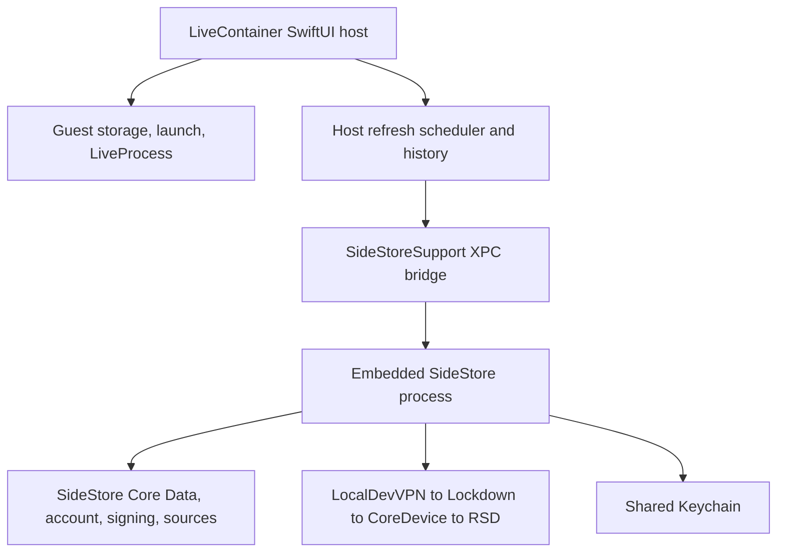
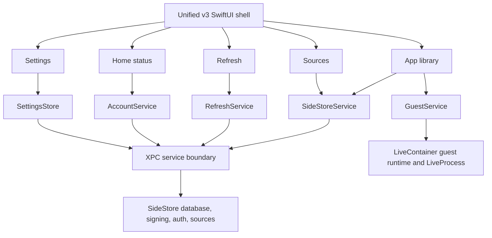

# v3 Unified LiveContainer + SideStore Architecture

## Purpose

v3 turns the combined LiveContainer and SideStore build into one coherent product. It removes the normal user-facing transition into a separate embedded SideStore application while preserving the existing LiveContainer guest runtime and SideStore signing, authentication, source, installation, and refresh systems.

This is an architectural integration. It is not a visual wrapper around SideStore's existing UIKit tab bar.

## Current architecture

The combined build is assembled from pinned upstream revisions:

- LiveContainer: `12377cf3b91d51739a33f14a302e5f522b238593`
- Embedded SideStore: `10ffa01ecdfe4203a7ad5d7f41c0d5de03bd8abb`

LiveContainer is the executable host. It launches into a SwiftUI tab shell and owns guest storage, guest models, guest launching, LiveProcess, guest return controls, and LiveContainer settings.

SideStore is embedded as a complete UIKit application. It owns its Core Data database, account and team state, certificates, signing, authentication, sideloaded app records, sources, app installation, and refresh pipeline.

The current bridge integrates refresh execution, result handoff, startup identity, and Keychain access. It does not integrate normal navigation or application state.

### Current navigation

LiveContainer currently provides Sources, Apps, Tweaks, and Settings. SideStore separately provides News, Sources, Browse, My Apps, and Settings. Opening SideStore launches it as a built-in guest, so the user encounters a second app shell and navigation stack.

## Duplication map

| Area | Current state | v3 resolution |
| --- | --- | --- |
| Navigation | Separate LiveContainer and SideStore tab bars and back stacks. | One host-owned v3 navigation shell. |
| Apps | LiveContainer owns guests. SideStore owns sideloaded installed apps. | One typed library view that aggregates references from both authoritative owners. |
| Sources | LiveContainer stores source URLs and cache independently. SideStore stores sources and catalog data in Core Data. | One Sources area, with SideStore as owner for sideload source state and clearly scoped guest-only content where required. |
| Refresh | Host owns schedule, retries, history, and verification UI. SideStore owns signing and refresh execution. | One Refresh screen backed by a shared orchestration contract. |
| Settings | Separate settings screens and preference stores. | One settings hierarchy. Each value retains exactly one authoritative owner. |
| Account and signing status | SideStore owns the actual state. Host has only selected refresh result metadata. | AccountService exposes bounded read models and commands from SideStore. |
| Status and warnings | Host and SideStore present separate partial status. | Home combines real guest, signing, expiration, connection, and refresh state. |

The apparent duplication must not be solved by copying SideStore data into LiveContainer. SideStore Core Data, SideStore Keychain state, and SideStore preferences remain authoritative. LiveContainer guest models, guest files, and runtime state remain authoritative.

## Proposed v3 architecture

LiveContainer remains the executable host. Its existing root tab shell is replaced with a unified SwiftUI shell that owns all normal user navigation:

- Home
- Apps
- Sources
- Refresh
- Settings

SideStore becomes a service provider for normal flows. The host communicates with it through a deliberately expanded XPC interface and receives small, non-secret data transfer objects. The host does not embed SideStore view controllers or open SideStore's tab controller in normal use.

### Services and ownership

| Service | Responsibility | Authoritative state |
| --- | --- | --- |
| `SideStoreService` | Installed app summaries, source catalog, install, update, refresh commands, expiration data. | SideStore database and operations. |
| `RefreshService` | One user-facing refresh state machine, scheduler state, retries, history, verification, and execution commands. | Existing host refresh history and SideStore execution result. |
| `AppLibraryService` | Aggregates typed guest and sideloaded app references. | LiveContainer guest state and SideStore app state. |
| `GuestService` | Guest launch, storage, runtime, LiveProcess, return controls, guest settings. | LiveContainer. |
| `AccountService` | Account, team, certificate, and signing status. | SideStore database and Keychain. |
| `SettingsStore` | Presents logical settings sections and routes writes to the existing owner. | Existing LiveContainer or SideStore preference store. |

## v3 user experience

### Home

Home shows the signing account state, nearest expiration, last verified refresh, scheduled refresh state, transport warnings, active guests, and quick actions.

### Apps

Apps is the only normal library view. It includes both SideStore-installed applications and LiveContainer guests, clearly identified by type. Existing actions remain available and route to their current underlying implementation. List, Grid, and Compact List apply to this unified presentation.

### Sources

Sources exposes SideStore source and browse behavior directly in the unified shell. Guest-specific source behavior remains explicitly scoped where it cannot safely use SideStore's installation pipeline.

### Refresh

Refresh is the only normal refresh screen. It provides manual refresh, schedule, preferred time, retry state, verification results, history, and appropriate diagnostics. The existing LocalDevVPN, Lockdown, CoreDevice, and RSD implementation is unchanged.

### Settings

Settings groups options into Account and Signing, Refresh, Guest Runtime, Interface, Storage, Advanced, and Diagnostics. Advanced SideStore settings and LiveContainer guest controls remain reachable without duplicating common settings.

## Migration plan

### Phase 1: Service contract and safety baseline

1. Define SideStore XPC data transfer objects and commands.
2. Add launch, reconnect, cancellation, timeout, and stale-response handling.
3. Preserve SideStore Core Data, Keychain, authentication, signing, and transport ownership.
4. Add unit tests for service boundaries before user-facing migration.

### Phase 2: Unified shell, Home, and Refresh

1. Replace the current root tab structure with the v3 shell.
2. Build Home from real SideStore and LiveContainer status.
3. Move the existing host refresh interface into Refresh.
4. Retain the current scheduler, history, retry, verification, and SideStore execution pipeline.

### Phase 3: Apps

1. Build `AppLibraryService` with stable typed identifiers.
2. Present guest and sideloaded apps in one view.
3. Route guest actions to existing `LCAppModel` behavior.
4. Route SideStore actions through the new service commands.
5. Apply current List, Grid, and Compact List presentation options.

### Phase 4: Sources, account, and settings

1. Bring SideStore sources and browse actions into the host shell.
2. Add SideStore account, certificate, and signing status to Settings.
3. Consolidate refresh settings.
4. Move SideStore transport and developer controls into Advanced.
5. Migrate duplicate source URL state only where compatibility is proven.

### Phase 5: Legacy route retirement

1. Hide the embedded SideStore launch action from normal navigation.
2. Keep an internal diagnostics fallback while upgrade and recovery behavior is validated.
3. Remove the fallback only after v3 feature parity and on-device validation are complete.

## Expected modules to change

### Builder repository

- `.github/workflows/livecontainer-build.yml`
- `scripts/patch_livecontainer_autorefresh.py`
- `scripts/patch_refresh_result_bridge.py`
- `scripts/patch_embedded_sidestore_startup.py`
- `scripts/patch_embedded_keychain.py`
- New v3 patch scripts and Swift templates
- Combined packaging verification and regression tests
- `README.md` and this document

### LiveContainer target

- `LiveContainerSwiftUI/App/LiveContainerSwiftUIApp.swift`
- `LiveContainerSwiftUI/Views/LCTabView.swift`
- `LiveContainerSwiftUI/Views/AppList/LCAppListView.swift`
- `LiveContainerSwiftUI/Views/Settings/LCSettingsView.swift`
- `LiveContainerSwiftUI/Models/LCAppModel.swift`
- `LiveContainerSwiftUI/Utilities/Shared.swift`
- `SideStoreSupport/SideStore.swift`
- `SideStoreSupport/XPCServer.h`
- `SideStoreSupport/XPCClient.m`
- `SideStoreSupport/SideStoreClient.swift`

### Embedded SideStore target

- `AltStore/Managing Apps/AppManager.swift`
- `AltStore/My Apps/MyAppsViewController.swift`
- `AltStore/Sources/*`
- `AltStore/Settings/*`
- `AltStore/Core/Model/DatabaseManager/*`
- `SideStore/Core/Auth/*`
- `SideStore/Core/Operations/*`

## Highest-risk integration points

1. **XPC process lifecycle:** The SideStore service must safely handle launch, reconnect, cancellation, stale responses, and termination.
2. **Database ownership:** LiveContainer must never directly open, copy, or synchronize SideStore Core Data.
3. **Keychain and authentication:** Account status can be exposed, but credentials and auth tokens must not cross the service boundary.
4. **Background refresh:** The host scheduler and SideStore signing pipeline stay internally separate while presenting one user-facing flow.
5. **Transport regression:** LocalDevVPN, Lockdown, CoreDevice, and RSD remain unchanged and require regression verification after each phase.
6. **App identity:** Guest and sideloaded apps can share names or bundle identifiers. The unified library needs stable typed identities and separate action routing.
7. **Upgrade preservation:** Existing SideStore database records, Keychain state, refresh history, guest files, layout preferences, and return-control preferences must survive upgrade.
8. **Build patch stability:** Because the project patches pinned upstream sources during CI, every new anchor needs idempotence checks, Swift parsing, and package verification.

## Completion criteria

v3 is complete only when the app launches directly into the unified shell, all normal SideStore and LiveContainer actions are reachable there, shared state has a single owner, the embedded SideStore tab UI is no longer part of normal navigation, existing user data survives upgrade, and automated plus on-device validation confirms signing, manual refresh, background refresh, verification, guest launch, LiveProcess, return controls, Keychain access, and the CoreDevice refresh transport.
